# UTS Lab 6 PM
Nama : Satyavira Prathama 
NIM : 221401126 
Lab : 6

# GreetCreate
This application is create so that people can try to create a greeting card for himself. This app is created with simplicity in mind.

Mockup:
[Figma](https://www.figma.com/design/vLoUD88j09EHsI7MgLB9zD/UTS_PM6?node-id=0-1&t=zDyDJ7uYhBoiap9a-1)

Screen Screenshot:
1. Loading Screen
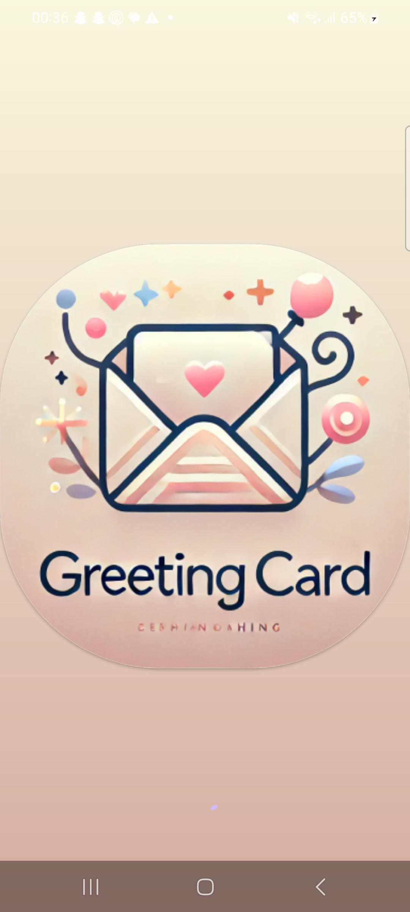
2. Home Screen
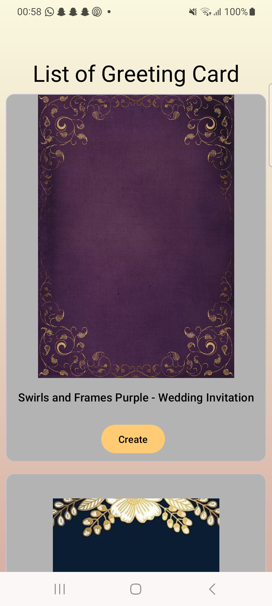
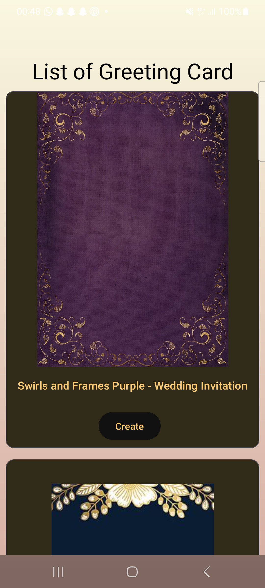
3. Create Greeting Card Screen
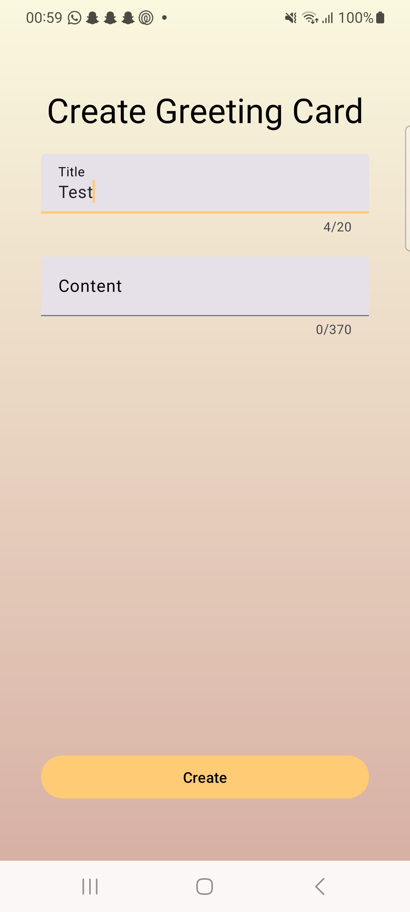
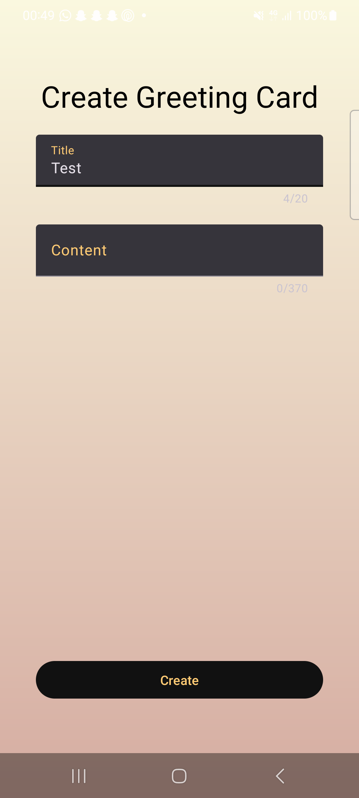
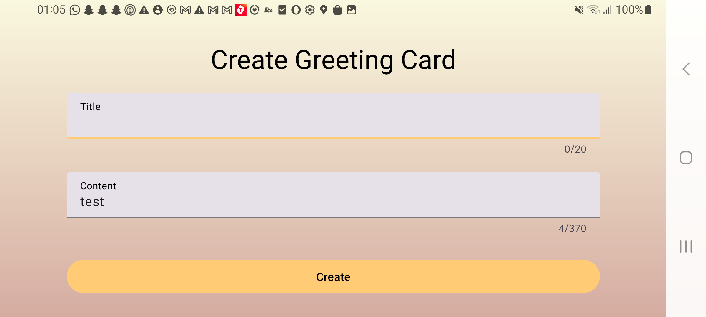
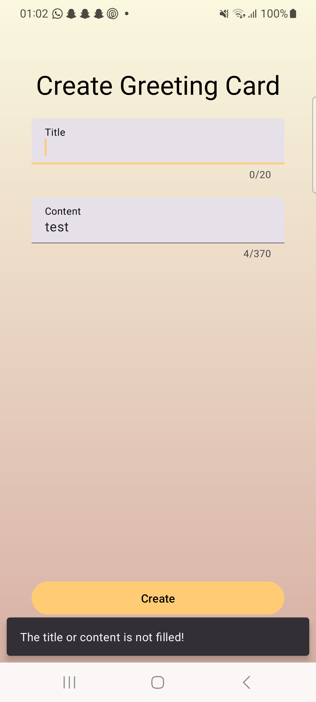
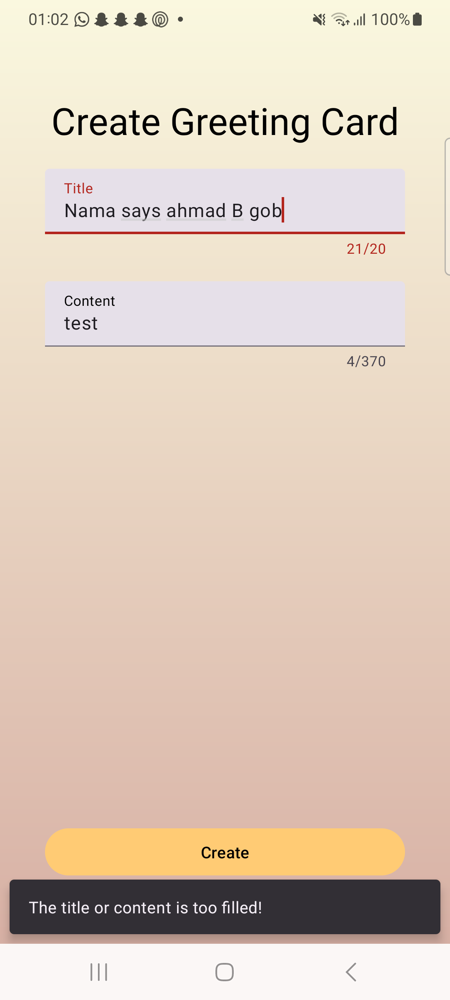
4. First Greeting Card Screen

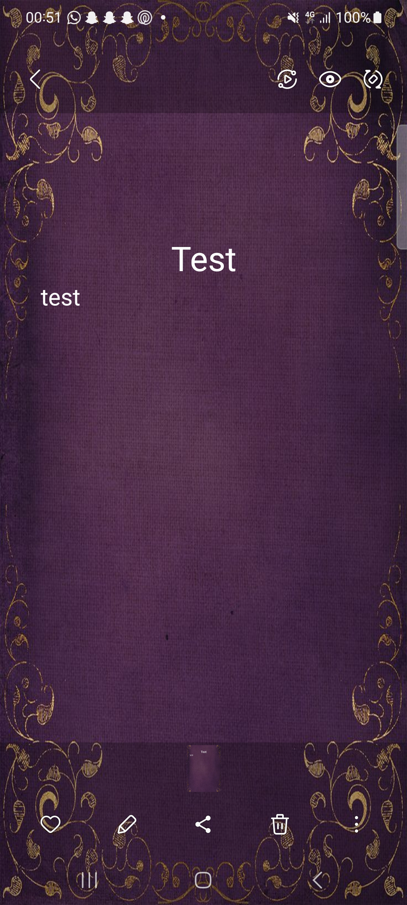
5. Second Greeting Card Screen
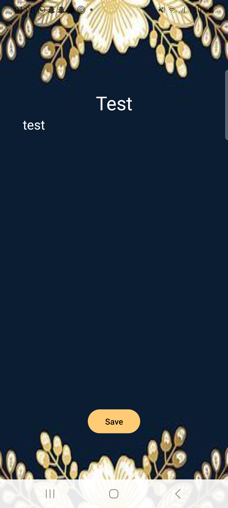
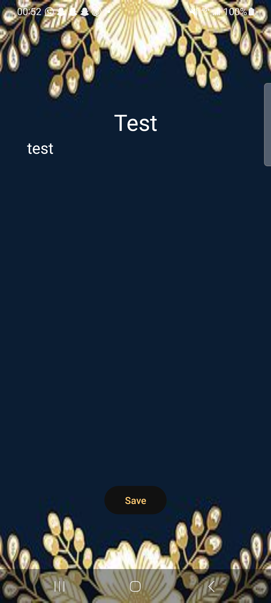
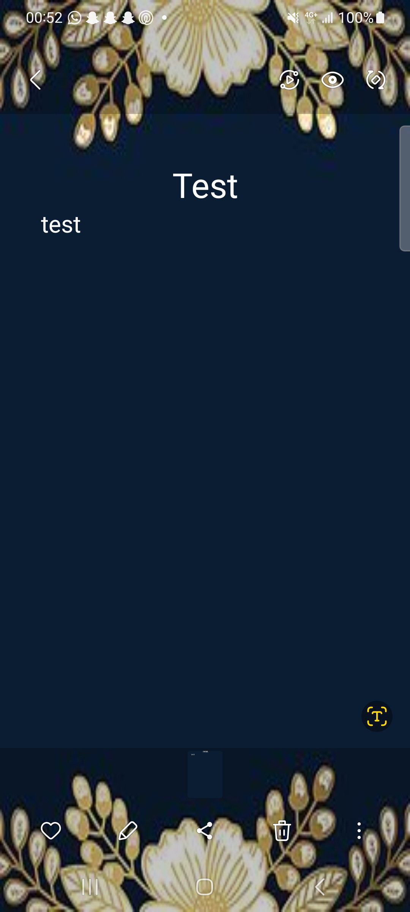
6. Third Greeting Card Screen

Credits:
1. [First Greeting Card Background](https://id.pinterest.com/pin/791789178260084495/)
2. [Second Greeting Card Background](https://id.pinterest.com/pin/773352567263582849/)
3. [Third Greeting Card Background](https://id.pinterest.com/pin/603975000022904635/)
4. [Pembuat Icon Android](https://icon.kitchen/)
5. [Logo Generator](https://chatgpt.com/)
